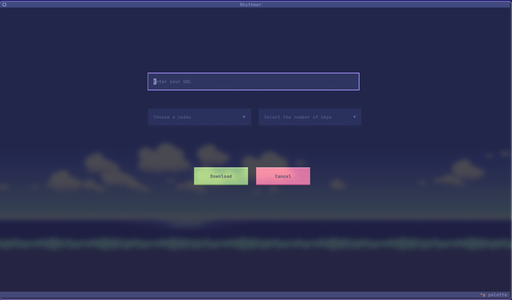

# Rhythmer - TUI Audio Downloader

A terminal-based user interface (TUI) for downloading high-quality audio. Built with Python, `yt-dlp`, and `textual` for a modern terminal experience with automatic metadata embedding.




## 📋 Features

### User Interface
- **Modern Terminal UI** – Built with Textual framework
- **Interactive Selectors** – Choose codec and bitrate from dropdown menus
- **Real-time Progress Bar** – Visual feedback during downloads
- **Cancel Support** – Interrupt downloads at any time with graceful shutdown
- **Theme Support** – Tokyo Night theme by default
- **Thread-safe Operations** – Downloads run in separate thread pool for responsive UI

### Download Features
- **High-Quality Audio Extraction** – Downloads best available audio stream
- **Multiple Audio Formats** – M4A, MP3, FLAC, Opus
- **Configurable Bitrate** – 64, 128, 256, or 320 kbps
- **Automatic Metadata Embedding** – Adds title, artist, and album tags
- **Thumbnail Embedding** – Album art automatically embedded into audio files
- **Configurable Download Path** – Set your preferred download directory
- **Cancellation Support** – Cancel downloads at any stage (downloading, processing, metadata)

## 🚀 Installation

### Prerequisites

- **Python 3.10 or higher** (uses `match` statement and modern type hints)
- **FFmpeg** – Required for audio conversion and thumbnail embedding

### Install FFmpeg

**Ubuntu/Debian:**
```bash
sudo apt update
sudo apt install ffmpeg
```

**macOS:**
```bash
brew install ffmpeg
```

**Windows:**
1. Download from [FFmpeg.org](https://ffmpeg.org/download.html)
2. Add the `bin` folder to your system PATH
3. Verify: `ffmpeg -version`

### Install Rhythmer

```bash
# Clone the repository
git clone https://github.com/Fkernel653/Rhythmer.git
cd Rhythmer

# Install dependencies
pip install -r requirements.txt
```

## 🎮 Usage

### First-Time Setup

Before downloading, configure your download directory:

```bash
# Interactive configuration
python add_path.py

# Enter your desired download path when prompted
# Leave empty to view current configuration
```

### Launch the TUI

```bash
python main.py
```

### Interface Walkthrough

1. **Enter URL** – Paste a URL (supports YouTube, SoundCloud, etc.)
2. **Select Codec** – Choose audio format from dropdown (M4A, MP3, FLAC, Opus)
3. **Select Bitrate** – Choose quality from dropdown (64–320 kbps)
4. **Click Download** – Start the download with real-time progress
5. **Cancel if needed** – Stop an ongoing download gracefully

### Keyboard Shortcuts

| Key | Action |
|-----|--------|
| `Tab` | Navigate between widgets |
| `Enter` | Select button or dropdown item |
| `Esc` | Close dropdown menu |
| `Ctrl+C` | Exit application |

## 📁 Project Structure

```
Rhythmer/
├── main.py                # TUI application entry point
├── add_path.py            # Path configuration handler
├── style.tcss             # Textual CSS styling
├── requirements.txt       # Python dependencies
├── pyproject.toml         # Project TOML file
├── README.md              # Documentation
├── LICENSE                # MIT License
├── screenshot.png         # Screenshot of the home screen
├── config.json            # User configuration (created on first run)
└── modules/
    ├── __init__.py        # Package initializer
    ├── download.py        # Audio download with yt-dlp & metadata
    ├── add_metadata.py    # Metadata tagging for all formats
    └── colors.py          # Terminal color definitions
```

## 🛠️ Technical Details

### Download Pipeline

```
1. User pastes URL in TUI
2. Select codec & bitrate
3. Press Download button
4. Validate configuration file
5. Extract video info (yt-dlp)
6. Download best audio stream (in thread pool)
7. Download thumbnail
8. Convert audio (FFmpeg)
9. Embed thumbnail as cover art
10. Add metadata tags (mutagen)
11. Save to configured directory
12. Show success notification
13. Reset UI for next download
```

### Threading Model

- **Main Thread** – Textual UI event loop
- **Thread Pool** – Single worker for blocking download operations
- **Async Tasks** – Monitor download progress and cancellation
- **Thread-safe Callbacks** – Progress updates via `call_from_thread()`

### Cancellation Handling

- User clicks Cancel → sets `download_cancelled` flag
- Download thread checks flag via callback
- yt-dlp receives interrupt signal
- Graceful shutdown with 2-3 second timeout
- UI resets to ready state

### Supported Formats & Metadata

| Format | Extension | Metadata Library | Tags Added |
|--------|-----------|------------------|-------------|
| M4A | .m4a | mutagen.mp4 | `©nam`, `©ART`, `©alb` |
| MP3 | .mp3 | mutagen.id3 | TIT2, TPE1, TALB |
| FLAC | .flac | mutagen.flac | title, artist, album |
| Opus | .opus | mutagen.oggopus | title, artist, album |

### Configuration File

The `config.json` file stores user preferences:

```json
{
    "path": "/home/user/Music"
}
```

- Created automatically on first configuration
- Validated on each download
- Directory created if it doesn't exist

## 📝 Requirements

### Python Dependencies (`requirements.txt`)

| Package | Version | Purpose |
|---------|---------|---------|
| `yt-dlp` | latest | Video/audio downloading and extraction |
| `textual` | latest | Terminal UI framework |
| `mutagen` | latest | Audio metadata tagging |

### System Dependencies

- **FFmpeg** – Required for audio conversion (must be in PATH)
- **Python 3.10+** – Runtime environment

## 🔥 Usage Examples

### Example 1: Configure and Download

```bash
# First time setup
python add_path.py
# Enter: ~/Music

# Download a track
python main.py
# Paste: https://youtu.be/dQw4w9WgXcQ
# Select: M4A, 256 kbps
# Click Download
# Output: ✓ Download completed!
```

### Example 2: High-quality MP3

```bash
python main.py
# Select: MP3, 320 kbps
# Paste any URL
# Click Download
# File saved as: Artist - Title.mp3 with embedded cover art
```

### Example 3: Lossless FLAC

```bash
python main.py
# Select: FLAC, 256 kbps (bitrate ignored for FLAC - lossless)
# Paste URL
# Click Download
```

### Example 4: Check Current Configuration

```bash
python add_path.py
# Press Enter without typing a path
# Shows current download directory
```

## 🐛 Troubleshooting

| Issue | Solution |
|-------|----------|
| **FFmpeg not found** | Install FFmpeg and ensure it's in PATH |
| **Config file not found** | Run `python add_path.py` to set download path |
| **Download stuck at 0%** | Check internet connection and URL validity |
| **Download stuck at 99%** | Normal - FFmpeg processing large file, wait |
| **Metadata not added** | Check file permissions and format support |
| **TUI doesn't launch** | Run `pip install --upgrade textual` |
| **"No module named modules"** | Run from project root directory |
| **Progress bar not showing** | Resize terminal window or restart app |
| **Cancel doesn't work immediately** | Download may take 2-3 seconds to fully stop |

### Debug Mode

To see detailed yt-dlp output, modify `modules/download.py`:

```python
# Change line ~65 in download.py
"quiet": False,  # Enable verbose output
"no_warnings": False,  # Show warnings
```

## 🤝 Contributing

1. Fork the repository
2. Create a feature branch: `git checkout -b feature/amazing-feature`
3. Make your changes
4. Test with different codecs and URLs
5. Commit: `git commit -m 'Add amazing feature'`
6. Push: `git push origin feature/amazing-feature`
7. Open a Pull Request

### Code Style
- Follow PEP 8
- Use type hints for all functions
- Add docstrings for classes and methods
- Test with different codecs and URL types
- Ensure thread safety for UI operations

## 🔮 Roadmap

- [ ] Playlist support
- [ ] Configuration UI in TUI
- [ ] Download queue
- [ ] Multiple simultaneous downloads
- [ ] Custom filename templates
- [ ] Proxy support
- [ ] Audio preview before download

## 📄 License

Distributed under the MIT License. See `LICENSE` file for details.

## 👨‍💻 Author

**Fkernel653** – [GitHub](https://github.com/Fkernel653)

## 🙏 Acknowledgments

- [Textual](https://github.com/Textualize/textual) – TUI framework
- [yt-dlp](https://github.com/yt-dlp/yt-dlp) – YouTube download library
- [mutagen](https://github.com/quodlibet/mutagen) – Audio metadata handling

## ⚠️ Disclaimer

**For educational purposes only.** Users are responsible for complying with platform Terms of Service and applicable copyright laws. Download only content you have permission to download.